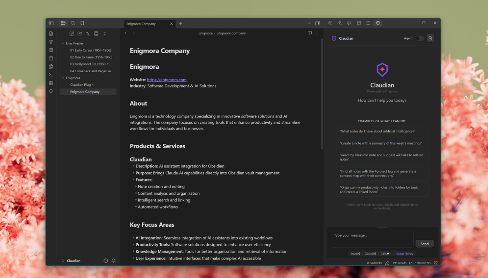

<p align="center">
  
</p>

<p align="center">
  <strong>Die ultimative Claude AI Integration für Obsidian</strong>
</p>

<p align="center">
  <a href="https://obsidian.md">
    
  </a>
  <a href="https://anthropic.com">
    
  </a>
  <a href="LICENSE">
    
  </a>
</p>

<p align="center">
  <a href="#installation">Installation</a> •
  <a href="#funktionen">Funktionen</a> •
  <a href="https://github.com/Enigmora/claudian/wiki">Dokumentation</a> •
  <a href="README.md">English</a> •
  <a href="README_ES.md">Español</a> •
  <a href="README_ZH.md">中文</a>
</p>

---

<p align="center">
  
</p>

---

## Was ist Claudian?

Claudian bringt **Claude AI** direkt in Ihren Obsidian Vault. Chatten Sie mit Claude in einem dedizierten Seitenpanel, verarbeiten Sie Ihre Notizen für intelligente Vorschläge und nutzen Sie den **Agentenmodus**, um Ihren gesamten Vault mit natürlichen Sprachbefehlen zu verwalten.

Ihr API-Schlüssel bleibt auf Ihrem Gerät. Ihre Notizen verlassen Ihren Vault nie, es sei denn, Sie bitten Claude, sie zu analysieren.

---

## Funktionen

### 💬 Integrierter Chat
Unterhalten Sie sich mit Claude, ohne Obsidian zu verlassen. Antworten werden in Echtzeit gestreamt, und Sie können jede Anfrage während der Generierung abbrechen.

### 📝 Intelligente Notizverarbeitung
Analysieren Sie Ihre Notizen und erhalten Sie intelligente Vorschläge für **Tags**, **Wikilinks** und **atomare Konzepte** basierend auf der bestehenden Struktur Ihres Vaults.

### 🤖 Agentenmodus
Verwalten Sie Ihren Vault mit natürlicher Sprache:
- *"Erstelle einen Projekte/2025 Ordner mit Unterordnern für jedes Quartal"*
- *"Verschiebe alle Notizen mit dem Tag #archiv in den Archiv-Ordner"*
- *"Übersetze diese Notiz ins Englische"*

**52 Aktionen** für Dateiverwaltung, Editor-Steuerung, Vorlagen, Lesezeichen, Canvas und mehr.

### 📊 Stapelverarbeitung
Verarbeiten Sie mehrere Notizen gleichzeitig mit Extraktionsvorlagen:
- Schlüsselideen und Zusammenfassungen
- Fragen und Aktionspunkte
- Konzepte und Verbindungen

### 🗺️ Konzeptkarten
Erstellen Sie visuelle Konzeptkarten aus ausgewählten Notizen, gerendert im Mermaid-Format.

### 🧠 Intelligente Modellauswahl
Automatische Modellorchestration leitet jede Aufgabe an das optimale Claude-Modell:
- Einfache Aufgaben → Haiku (schnell & wirtschaftlich)
- Inhaltserstellung → Sonnet (ausgewogen)
- Tiefe Analyse → Opus (maximale Qualität)

### 🌍 Mehrsprachig
Volle Unterstützung für **Englisch**, **Spanisch**, **Chinesisch** und **Deutsch**. Weitere Sprachen folgen bald.

---

## Installation

### Aus Community Plugins (Empfohlen)
1. Öffnen Sie **Einstellungen → Community Plugins**
2. Klicken Sie auf **Durchsuchen** und suchen Sie nach "Claudian"
3. Klicken Sie auf **Installieren**, dann **Aktivieren**

### Manuelle Installation
1. Laden Sie die neueste Version von [Releases](https://github.com/Enigmora/claudian/releases) herunter
2. Entpacken Sie nach `.obsidian/plugins/claudian/` in Ihrem Vault
3. Aktivieren Sie in **Einstellungen → Community Plugins**

---

## Schnellstart

1. Holen Sie sich Ihren API-Schlüssel auf [console.anthropic.com](https://console.anthropic.com/)
2. Öffnen Sie **Einstellungen → Claudian** und geben Sie Ihren Schlüssel ein
3. Klicken Sie auf das Claudian-Symbol im Ribbon oder nutzen Sie die Befehlspalette
4. Beginnen Sie zu chatten!

Für detaillierte Konfigurationsoptionen siehe die [Konfigurationsanleitung](https://github.com/Enigmora/claudian/wiki/Configuration).

---

## Dokumentation

Besuchen Sie das **[Wiki](https://github.com/Enigmora/claudian/wiki)** für vollständige Dokumentation:

- [Erste Schritte](https://github.com/Enigmora/claudian/wiki/Getting-Started)
- [Chat-Oberfläche](https://github.com/Enigmora/claudian/wiki/Features/Chat-Interface)
- [Agentenmodus](https://github.com/Enigmora/claudian/wiki/Features/Agent-Mode)
- [Stapelverarbeitung](https://github.com/Enigmora/claudian/wiki/Features/Batch-Processing)
- [Fehlerbehebung](https://github.com/Enigmora/claudian/wiki/Troubleshooting)

---

## Datenschutz und Sicherheit

- **Lokale Speicherung**: Ihr API-Schlüssel wird nur auf Ihrem Gerät gespeichert
- **Keine Telemetrie**: Wir sammeln keine Nutzungsdaten
- **Open Source**: 100% überprüfbarer Code

---

## Mitwirken

Beiträge sind willkommen! Details finden Sie in unserem [Leitfaden für Mitwirkende](CONTRIBUTING.md).

```bash
git clone https://github.com/Enigmora/claudian.git
cd claudian && npm install
npm run dev
```

---

## Lizenz

[MIT-Lizenz](LICENSE) — verwenden Sie es frei in Ihren Projekten.

---

<p align="center">
  
</p>

<p align="center">
  <strong>Claudian</strong><br>
  <sub>Entwickelt von <a href="https://github.com/Enigmora">Enigmora</a></sub>
</p>
