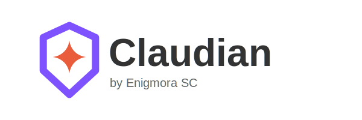

<p align="center">
  
</p>

<p align="center">
  <strong>Obsidian向けの究極のClaude AI統合</strong>
</p>

<p align="center">
  <a href="https://enigmora.com"></a>
  <a href="https://obsidian.md"></a>
  <a href="https://anthropic.com"></a>
  <a href="LICENSE"></a>
</p>

<p align="center">
  <a href="#インストール">インストール</a> •
  <a href="#機能">機能</a> •
  <a href="https://github.com/Enigmora/claudian/wiki">ドキュメント</a> •
  <a href="README.md">English</a> •
  <a href="README_ES.md">Español</a> •
  <a href="README_ZH.md">中文</a> •
  <a href="README_DE.md">Deutsch</a> •
  <a href="README_FR.md">Français</a>
</p>

---

<p align="center">
  
</p>

---

## Claudianとは？

Claudianは**Claude AI**をObsidianボールトに直接統合します。専用のサイドパネルでClaudeとチャットし、ノートを処理してスマートな提案を取得し、**エージェントモード**を使用して自然言語コマンドでボールト全体を管理できます。

あなたのAPIキーはデバイスに保存されます。Claudeに分析を依頼しない限り、ノートがボールトから出ることはありません。

---

## 機能

### 💬 統合チャット
Obsidianを離れずにClaudeと会話できます。レスポンスはリアルタイムでストリーミングされ、生成中にいつでもリクエストを停止できます。

### 📝 スマートノート処理
ノートを分析し、ボールトの既存構造に基づいた**タグ**、**ウィキリンク**、**アトミックコンセプト**のインテリジェントな提案を受け取ります。

### 🤖 エージェントモード
自然言語でボールトを管理：
- *「Projects/2025フォルダを作成し、各四半期のサブフォルダを作成して」*
- *「#archiveタグが付いたすべてのノートをArchiveフォルダに移動して」*
- *「このノートを英語に翻訳して」*

ファイル管理、エディター制御、テンプレート、ブックマーク、キャンバスなど**52のアクション**。

### 📊 バッチ処理
抽出テンプレートを使用して複数のノートを一度に処理：
- 主要なアイデアと要約
- 質問とアクションアイテム
- コンセプトと接続

### 🗺️ コンセプトマップ
選択したノートからMermaid形式でレンダリングされるビジュアルコンセプトマップを生成。

### 🧠 インテリジェントなモデル選択
自動モデルオーケストレーションが各タスクを最適なClaudeモデルにルーティング：
- シンプルなタスク → Haiku（高速＆経済的）
- コンテンツ作成 → Sonnet（バランス）
- 深い分析 → Opus（最高品質）

### 🌍 多言語対応
**英語**、**スペイン語**、**中国語**、**ドイツ語**、**フランス語**、**日本語**を完全サポート。さらに多くの言語が近日公開予定。

---

## インストール

### コミュニティプラグインから（推奨）
1. **設定 → コミュニティプラグイン**を開く
2. **参照**をクリックして「Claudian」を検索
3. **インストール**をクリックし、次に**有効化**

### 手動インストール
1. [Releases](https://github.com/Enigmora/claudian/releases)から最新バージョンをダウンロード
2. ボールトの`.obsidian/plugins/claudian/`に解凍
3. **設定 → コミュニティプラグイン**で有効化

---

## クイックスタート

1. [console.anthropic.com](https://console.anthropic.com/)でAPIキーを取得
2. **設定 → Claudian**を開いてキーを入力
3. リボンのClaudianアイコンをクリックするか、コマンドパレットを使用
4. チャットを開始！

> **注意：** このプラグインにはAnthropicのAPIキーが必要です。APIの使用には[Anthropicの料金](https://www.anthropic.com/pricing)に基づいてコストが発生する場合があります。ClaudianはAnthropicとは提携していません。

詳細な設定オプションについては、[設定ガイド](https://github.com/Enigmora/claudian/wiki/Configuration)を参照してください。

---

## ドキュメント

完全なドキュメントについては**[Wiki](https://github.com/Enigmora/claudian/wiki)**をご覧ください：

- [はじめに](https://github.com/Enigmora/claudian/wiki/Getting-Started)
- [チャットインターフェース](https://github.com/Enigmora/claudian/wiki/Features/Chat-Interface)
- [エージェントモード](https://github.com/Enigmora/claudian/wiki/Features/Agent-Mode)
- [バッチ処理](https://github.com/Enigmora/claudian/wiki/Features/Batch-Processing)
- [トラブルシューティング](https://github.com/Enigmora/claudian/wiki/Troubleshooting)

---

## プライバシーとセキュリティ

- **ネットワーク使用**: このプラグインはリクエストを処理するために[Anthropic API](https://api.anthropic.com)に接続します。ノートの内容は、明示的にClaudeに分析を依頼した場合にのみ送信されます。
- **ローカルストレージ**: APIキーはObsidianのプラグインデータ内のデバイスにのみ保存されます
- **テレメトリなし**: 使用データや分析情報を収集しません
- **オープンソース**: [MITライセンス](LICENSE)の下で100%監査可能なコード

---

## コントリビュート

コントリビューションを歓迎します！詳細は[コントリビューションガイド](CONTRIBUTING.md)をご覧ください。

```bash
git clone https://github.com/Enigmora/claudian.git
cd claudian && npm install
npm run dev
```

---

## ライセンス

[MITライセンス](LICENSE) — プロジェクトで自由に使用できます。

---

<p align="center">
  
</p>

<p align="center">
  <strong>Claudian</strong><br>
  <sub>開発: <a href="https://github.com/Enigmora">Enigmora</a></sub>
</p>
