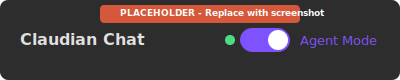
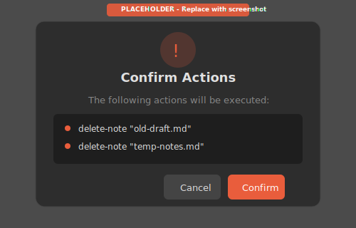

# Modo Agente

El Modo Agente transforma a Claude en un asistente inteligente que puede ejecutar acciones en tu bóveda de Obsidian a través de comandos en lenguaje natural.

---

## Descripción General

Con el Modo Agente activado, puedes:

- Crear, mover, renombrar y eliminar notas y carpetas
- Copiar notas a nuevas ubicaciones (preservando el contenido exacto)
- Leer y modificar contenido de notas
- Traducir o transformar contenido bajo petición
- Buscar notas por título, contenido o tags
- Actualizar frontmatter (metadatos YAML)
- **Manipulación del editor en tiempo real** (insertar, seleccionar, navegar)
- **Ejecutar comandos de Obsidian** programáticamente
- **Gestión de Notas Diarias, Plantillas y Marcadores**
- **Manipulación de Canvas** (nodos, conexiones, grupos)
- **Búsqueda avanzada** (por encabezado, ID de bloque, tags)
- **Control del espacio de trabajo** (abrir archivos, dividir vistas)

Todo a través de solicitudes simples y conversacionales.

> **Ver también:** [Referencia de Acciones del Agente](Features-Agent-Actions-Reference.es) para la lista completa de 52 acciones disponibles.

### Progreso Visual

Cuando el Modo Agente ejecuta acciones, verás indicadores de progreso en tiempo real mostrando cada acción mientras se completa. Esto proporciona retroalimentación inmediata sobre lo que está sucediendo en tu bóveda.

---

## Activar el Modo Agente

### Toggle en el Chat

Haz clic en el toggle de modo agente en el encabezado del chat para activar/desactivar:



### Ajuste por Defecto

Puedes iniciar todos los chats nuevos con el Modo Agente activado:
1. Ve a **Ajustes > Claudian**
2. Activa **"Activar modo agente por defecto"**

---

## Acciones Disponibles

### Gestión de Carpetas

| Acción | Comando de Ejemplo |
|--------|-------------------|
| Crear carpeta | "Crea una carpeta llamada Proyectos" |
| Crear carpetas anidadas | "Crea la estructura de carpetas Proyectos/2024/Q1" |
| Eliminar carpeta vacía | "Elimina la carpeta old-drafts" |
| Listar contenido de carpeta | "¿Qué hay en mi carpeta Proyectos?" |

### Gestión de Notas

| Acción | Comando de Ejemplo |
|--------|-------------------|
| Crear nota | "Crea una nota sobre notas de reunión en Reuniones/" |
| Leer nota | "Muéstrame el contenido de mi lista de tareas" |
| Copiar nota | "Copia mis notas de reuniones a Archivo/2024/" |
| Renombrar nota | "Renombra 'borrador.md' a 'informe-final.md'" |
| Mover nota | "Mueve todas las notas de Python a Programación/" |
| Eliminar nota | "Elimina las notas vacías en Borradores/" |

### Modificación de Contenido

| Acción | Comando de Ejemplo |
|--------|-------------------|
| Agregar contenido | "Agrega una nueva sección a mi plan de proyecto" |
| Agregar al inicio | "Agrega un resumen al inicio de esta nota" |
| Reemplazar contenido | "Reescribe la introducción de mi ensayo" |
| Traducir contenido | "Traduce esta nota al inglés" |
| Actualizar frontmatter | "Agrega el tag 'importante' a esta nota" |

### Búsqueda y Consulta

| Acción | Comando de Ejemplo |
|--------|-------------------|
| Buscar notas | "Encuentra todas las notas sobre JavaScript" |
| Obtener info de nota | "¿Qué tags tiene mi nota de proyecto?" |
| Encontrar enlaces | "¿Qué notas enlazan a 'Básicos de Python'?" |

---

## Cómo Funciona

1. **Envías una solicitud** en lenguaje natural
2. **Claude interpreta** tu intención
3. **Se generan acciones** como comandos estructurados
4. **Se solicita confirmación** para acciones destructivas
5. **Las acciones se ejecutan** en tu bóveda
6. **Se reportan los resultados** en el chat

```
┌──────────────────────────────────────────────────────────┐
│ Usuario: "Crea una carpeta Proyectos con Docs y Código" │
└──────────────────────────────────────────────────────────┘
                        │
                        ▼
┌──────────────────────────────────────────────────────────┐
│ Claude analiza y genera acciones:                        │
│ 1. create-folder: Proyectos                              │
│ 2. create-folder: Proyectos/Docs                         │
│ 3. create-folder: Proyectos/Código                       │
└──────────────────────────────────────────────────────────┘
                        │
                        ▼
┌──────────────────────────────────────────────────────────┐
│ El plugin ejecuta las acciones y reporta:                │
│ "Creada la carpeta Proyectos con Docs y Código"          │
└──────────────────────────────────────────────────────────┘
```

---

## Operaciones de Archivo vs Transformación de Contenido

El Modo Agente distingue entre dos tipos de solicitudes:

### Operaciones de Archivo

Cuando pides **copiar**, **mover**, **respaldar**, **duplicar** o **clonar** una nota, el contenido se preserva exactamente tal cual está, byte por byte. No ocurre ningún resumen o modificación.

**Ejemplos:**
- "Copia mis notas de reuniones a Archivo/"
- "Respalda todas las notas en Proyectos/ a Respaldos/"
- "Duplica la nota de plantilla"

### Transformación de Contenido

Cuando solicitas explícitamente **traducir**, **resumir**, **reescribir** o **transformar** contenido, Claude modificará el contenido según lo solicitado.

**Ejemplos:**
- "Traduce esta nota al español"
- "Resume los puntos clave de mis notas de investigación"
- "Reescribe la introducción para que sea más concisa"

**Nota:** Las solicitudes ambiguas se tratan como operaciones de archivo por defecto. Si quieres que el contenido sea modificado, sé explícito sobre la transformación que necesitas.

---

## Sistema de Confirmación

Las acciones destructivas requieren tu confirmación antes de ejecutarse:



### Acciones que Requieren Confirmación

- Eliminar notas
- Eliminar carpetas
- Sobrescribir archivos existentes
- Reemplazar contenido completo de nota
- Cualquier modificación en carpetas protegidas

### Diálogo de Confirmación

El diálogo muestra:
- Lista de acciones pendientes
- Íconos de advertencia para operaciones destructivas
- Botones **Cancelar** y **Confirmar**

Puedes desactivar las confirmaciones en los ajustes (no recomendado).

---

## Carpetas Protegidas

Algunas carpetas están protegidas de modificación por defecto:

- `.obsidian` - Configuración de Obsidian
- `templates` - Plantillas de notas
- `_templates` - Carpeta alternativa de plantillas

### Personalizar Carpetas Protegidas

1. Ve a **Ajustes > Claudian**
2. Edita **Carpetas protegidas** (lista separada por comas)
3. Agrega o elimina rutas de carpetas según necesites

**Advertencia:** Eliminar `.obsidian` de la protección podría causar corrupción de la bóveda.

---

## Características de Seguridad

### Límites de Acciones

El máximo de acciones por mensaje es configurable (por defecto: 20). Esto previene operaciones descontroladas de una sola solicitud.

### Validación de Rutas

Todas las rutas de archivos se validan para prevenir:
- Ataques de path traversal
- Acceso fuera de la bóveda
- Nombres de archivo inválidos

### Consideración de Reversión

**Nota:** Las acciones no son automáticamente reversibles. Ten cuidado con las operaciones de eliminación. Considera mantener respaldos de notas importantes.

---

## Ejemplos de Uso

### Organizar un Proyecto

```
"Crea una estructura de proyecto para mi nueva app:
- AppProyecto/
  - Documentación/
  - Código/
  - Pruebas/
Y crea una nota README en la carpeta principal"
```

### Limpiar Notas

```
"Encuentra todas las notas vacías en mi carpeta Borradores y lístalas"
```

Luego:

```
"Elimina todas esas notas vacías"
```

### Etiquetado por Lotes

```
"Agrega el tag 'revisar' a todas las notas en la carpeta Borradores"
```

### Actualizaciones de Contenido

```
"En mi carpeta de notas-diarias, agrega una sección 'Revisado' al final de la nota de hoy"
```

### Respaldar Notas

```
"Copia todas las notas de Proyectos/Activos a Respaldos/2024/"
```

### Traducir Notas

```
"Traduce mi nota README al español y guárdala como README-ES"
```

---

## Mejores Prácticas

1. **Empieza pequeño**: Prueba con acciones simples antes de operaciones complejas
2. **Sé específico**: "Mueve nota.md a Archivo/" es más claro que "archiva esa nota"
3. **Verifica primero**: Pide a Claude que liste o lea antes de modificar
4. **Mantén respaldos**: Especialmente antes de operaciones masivas
5. **Usa carpetas protegidas**: Mantén las carpetas importantes seguras

---

## Limitaciones

- No puede ejecutar código arbitrario
- No puede acceder a archivos fuera de la bóveda
- No puede modificar carpetas protegidas
- Limitado al máximo de acciones por mensaje configurado
- Algunas operaciones complejas pueden necesitar múltiples solicitudes

---

## Solución de Problemas

### El Agente No Responde

1. Verifica que el Modo Agente esté activado (toggle en el encabezado)
2. Comprueba que tu solicitud sea accionable
3. Intenta reformular tu comando

### Las Acciones Fallan

1. Verifica si el objetivo está en una carpeta protegida
2. Verifica que el archivo/carpeta exista
3. Comprueba problemas de permisos en tu sistema de archivos

Consulta [Solución de Problemas](Troubleshooting.es) para más soluciones.

---

## Características Relacionadas

- [Referencia de Acciones del Agente](Features-Agent-Actions-Reference.es) - Catálogo completo de acciones (52 acciones)
- [Interfaz de Chat](Features-Chat-Interface.es) - Uso básico del chat
- [Configuración](Configuration.es) - Ajustes del Modo Agente
