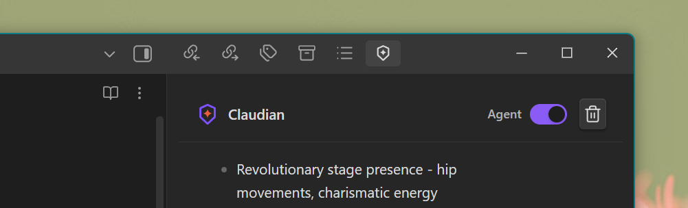
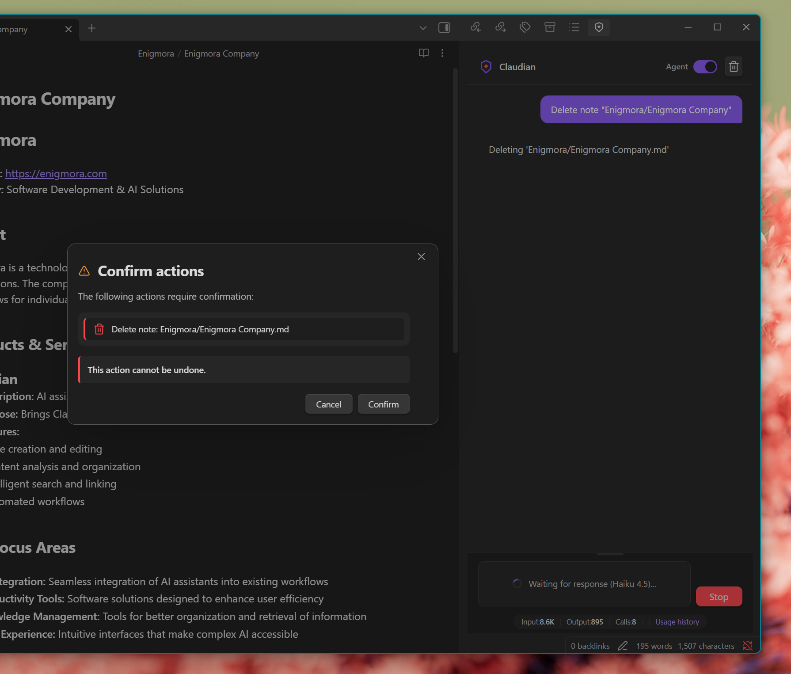

# Agent Mode

Agent Mode transforms Claude into an intelligent assistant that can execute actions on your Obsidian vault through natural language commands.

---

## Overview

With Agent Mode enabled, you can:

- Create, move, rename, and delete notes and folders
- Copy notes to new locations (preserving exact content)
- Read and modify note content
- Translate or transform content on request
- Search notes by title, content, or tags
- Update frontmatter (YAML metadata)
- **Real-time editor manipulation** (insert, select, navigate)
- **Execute Obsidian commands** programmatically
- **Daily Notes, Templates, and Bookmarks** management
- **Canvas manipulation** (nodes, edges, groups)
- **Advanced search** (by heading, block ID, tags)
- **Workspace control** (open files, split views)

All through simple, conversational requests.

> **See also:** [Agent Actions Reference](Agent-Actions-Reference) for the complete list of 52 available actions.

### Visual Progress

When Agent Mode executes actions, you'll see real-time progress indicators showing each action as it completes. This provides immediate feedback on what's happening in your vault.

---

## Enabling Agent Mode

### Toggle in Chat

Click the agent mode toggle in the chat header to enable/disable:



### Default Setting

You can start all new chats with Agent Mode enabled:
1. Go to **Settings > Claudian**
2. Enable **"Enable agent mode by default"**

---

## Available Actions

### Folder Management

| Action | Example Command |
|--------|-----------------|
| Create folder | "Create a folder called Projects" |
| Create nested folders | "Create Projects/2024/Q1 folder structure" |
| Delete empty folder | "Delete the old-drafts folder" |
| List folder contents | "What's in my Projects folder?" |

### Note Management

| Action | Example Command |
|--------|-----------------|
| Create note | "Create a note about meeting notes in Meetings/" |
| Read note | "Show me the contents of my todo list" |
| Copy note | "Copy my meeting notes to Archive/2024/" |
| Rename note | "Rename 'draft.md' to 'final-report.md'" |
| Move note | "Move all Python notes to Programming/" |
| Delete note | "Delete the empty notes in Drafts/" |

### Content Modification

| Action | Example Command |
|--------|-----------------|
| Append content | "Add a new section to my project plan" |
| Prepend content | "Add a summary at the top of this note" |
| Replace content | "Rewrite the introduction of my essay" |
| Translate content | "Translate this note to English" |
| Update frontmatter | "Add the tag 'important' to this note" |

### Search and Query

| Action | Example Command |
|--------|-----------------|
| Search notes | "Find all notes about JavaScript" |
| Get note info | "What tags does my project note have?" |
| Find links | "Which notes link to 'Python basics'?" |

---

## How It Works

1. **You send a request** in natural language
2. **Claude interprets** your intention
3. **Actions are generated** as structured commands
4. **Confirmation** is requested for destructive actions
5. **Actions execute** on your vault
6. **Results are reported** in the chat

```
┌─────────────────────────────────────────────────────┐
│ User: "Create a Projects folder with Docs and Code" │
└─────────────────────────────────────────────────────┘
                        │
                        ▼
┌─────────────────────────────────────────────────────┐
│ Claude analyzes and generates actions:              │
│ 1. create-folder: Projects                          │
│ 2. create-folder: Projects/Docs                     │
│ 3. create-folder: Projects/Code                     │
└─────────────────────────────────────────────────────┘
                        │
                        ▼
┌─────────────────────────────────────────────────────┐
│ Plugin executes actions and reports:                │
│ "Created Projects folder with Docs and Code"        │
└─────────────────────────────────────────────────────┘
```

---

## File Operations vs Content Transformation

Agent Mode distinguishes between two types of requests:

### File Operations

When you ask to **copy**, **move**, **backup**, **duplicate**, or **clone** a note, the content is preserved exactly as-is, byte-by-byte. No summarization or modification occurs.

**Examples:**
- "Copy my meeting notes to Archive/"
- "Backup all notes in Projects/ to Backups/"
- "Duplicate the template note"

### Content Transformation

When you explicitly request to **translate**, **summarize**, **rewrite**, or **transform** content, Claude will modify the content as requested.

**Examples:**
- "Translate this note to Spanish"
- "Summarize the key points from my research notes"
- "Rewrite the introduction to be more concise"

**Note:** Ambiguous requests are treated as file operations by default. If you want content modified, be explicit about the transformation you need.

---

## Confirmation System

Destructive actions require your confirmation before executing:



### Actions Requiring Confirmation

- Deleting notes
- Deleting folders
- Overwriting existing files
- Replacing entire note content
- Any modification to protected folders

### Confirmation Dialog

The dialog shows:
- List of pending actions
- Warning icons for destructive operations
- **Cancel** and **Confirm** buttons

You can disable confirmations in settings (not recommended).

---

## Protected Folders

Some folders are protected from modification by default:

- `.obsidian` - Obsidian configuration
- `templates` - Note templates
- `_templates` - Alternative templates folder

### Customizing Protected Folders

1. Go to **Settings > Claudian**
2. Edit **Protected folders** (comma-separated list)
3. Add or remove folder paths as needed

**Warning:** Removing `.obsidian` from protection could cause vault corruption.

---

## Safety Features

### Action Limits

Maximum actions per message is configurable (default: 20). This prevents runaway operations from a single request.

### Path Validation

All file paths are validated to prevent:
- Path traversal attacks
- Access outside the vault
- Invalid file names

### Rollback Consideration

**Note:** Actions are not automatically reversible. Be careful with delete operations. Consider keeping backups of important notes.

---

## Usage Examples

### Organize a Project

```
"Create a project structure for my new app:
- AppProject/
  - Documentation/
  - Source/
  - Tests/
And create a README note in the main folder"
```

### Clean Up Notes

```
"Find all empty notes in my Drafts folder and list them"
```

Then:

```
"Delete all those empty notes"
```

### Batch Tagging

```
"Add the tag 'review-needed' to all notes in the Drafts folder"
```

### Content Updates

```
"In my daily-notes folder, add a 'Reviewed' section at the end of today's note"
```

### Backup Notes

```
"Copy all notes from Projects/Active to Backups/2024/"
```

### Translate Notes

```
"Translate my README note to Spanish and save it as README-ES"
```

---

## Best Practices

1. **Start small**: Test with simple actions before complex operations
2. **Be specific**: "Move note.md to Archive/" is clearer than "archive that note"
3. **Verify first**: Ask Claude to list or read before modifying
4. **Keep backups**: Especially before bulk operations
5. **Use protected folders**: Keep important folders safe

---

## Limitations

- Cannot execute arbitrary code
- Cannot access files outside the vault
- Cannot modify protected folders
- Limited to configured max actions per message
- Some complex operations may need multiple requests

---

## Troubleshooting

### Agent Not Responding

1. Verify Agent Mode is enabled (toggle in header)
2. Check that your request is actionable
3. Try rephrasing your command

### Actions Failing

1. Check if the target is in a protected folder
2. Verify the file/folder exists
3. Check for permission issues on your filesystem

See [Troubleshooting](../Troubleshooting) for more solutions.

---

## Related Features

- [Agent Actions Reference](Agent-Actions-Reference) - Complete action catalog (52 actions)
- [Chat Interface](Chat-Interface) - Basic chat usage
- [Configuration](../Configuration) - Agent Mode settings
