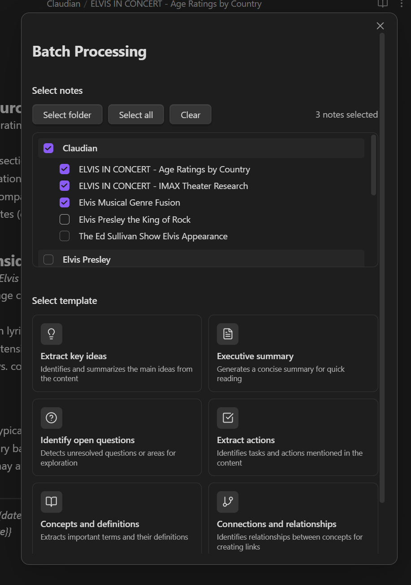
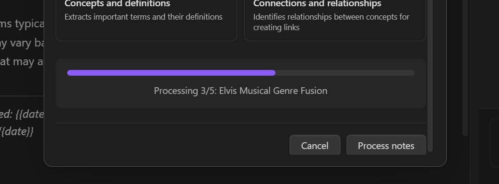

# Batch Processing

Batch processing allows you to analyze multiple notes at once using predefined extraction templates, generating consolidated insights.

---

## Overview

With batch processing, you can:

- Process many notes simultaneously
- Apply consistent analysis across your vault
- Extract specific types of information
- Generate summary reports

---

## Opening Batch Processing

1. Open the command palette with `Ctrl/Cmd + P`
2. Search for **"Batch process notes"**
3. Select the command



---

## Selecting Notes

The batch modal provides two selection methods:

### By Folder

1. Click on a folder in the list
2. All notes in that folder will be selected
3. Subfolders are included recursively

### Individual Selection

1. Browse the folder tree
2. Click individual notes to select/deselect
3. Use `Ctrl/Cmd + Click` for multiple selection

### Selection Indicators

- Checkbox shows selection state
- Counter displays total selected notes
- Folder badges show note counts

---

## Extraction Templates

Choose a template that matches your analysis goal:

### Extract Key Ideas

**Purpose:** Summarize the main ideas from each note

**Output includes:**
- Main points from each note
- Common themes across notes
- Key takeaways

**Best for:** Research notes, meeting notes, articles

---

### Executive Summary

**Purpose:** Generate a concise summary

**Output includes:**
- Brief overview of content
- Most important findings
- Conclusions

**Best for:** Long documents, reports, documentation

---

### Identify Questions

**Purpose:** Find open questions and topics to explore

**Output includes:**
- Explicit questions in the notes
- Implied questions
- Areas needing research

**Best for:** Research notes, study materials, project planning

---

### Extract Actions

**Purpose:** List tasks and action items

**Output includes:**
- Explicit TODOs
- Implied tasks
- Deadlines (if mentioned)

**Best for:** Meeting notes, project notes, planning documents

---

### Concepts and Definitions

**Purpose:** Create a glossary of terms

**Output includes:**
- Key terms and their definitions
- Technical vocabulary
- Concept explanations

**Best for:** Study notes, technical documentation, learning materials

---

### Connections

**Purpose:** Identify relationships between notes

**Output includes:**
- Common themes
- Cross-references
- Potential wikilinks

**Best for:** Research, knowledge base building, topic exploration

---

## Running Batch Processing

1. Select your notes
2. Choose an extraction template
3. Click **Process**
4. Wait for completion



### Progress Tracking

During processing, you'll see:
- Current note being processed
- Progress bar
- Elapsed time
- Estimated remaining time

---

## Output

Results are saved as a new note in your configured notes folder:

### Output Format

```markdown
---
created: 2024-01-21
source: claudian-batch
template: extract-key-ideas
notes_processed: 5
---

# Batch Processing: Extract Key Ideas

## Summary

[Overview of findings]

## Results by Note

### Note 1 Title
- Key idea 1
- Key idea 2

### Note 2 Title
- Key idea 1
- Key idea 2

## Common Themes

- Theme 1
- Theme 2

## Related Links

- [[Note 1]]
- [[Note 2]]
```

---

## Tips for Effective Batch Processing

### Selecting Notes

- Group related notes for better analysis
- Avoid mixing unrelated content
- Consider processing by folder/topic

### Choosing Templates

- Match template to your goal
- "Extract key ideas" is good for general analysis
- "Connections" helps build your knowledge graph

### Large Batches

- Processing time increases with note count
- Consider splitting very large batches
- API costs increase with more notes

---

## API Usage

Batch processing sends each note to Claude for analysis:

- Each note = one API call
- Token usage depends on note length
- Consider note count and length for cost

### Reducing Costs

- Process fewer notes at once
- Use Claude 3.5 Haiku for simpler extractions
- Reduce max tokens in settings

---

## Limitations

- Maximum notes per batch depends on API limits
- Very long notes may be truncated
- Processing large batches takes time
- Each template produces a specific output format

---

## Use Cases

### Research Synthesis

Process all notes from a research topic to:
- Identify key themes
- Find gaps in your knowledge
- Generate a literature summary

### Project Review

Process project notes to:
- Extract all action items
- Find open questions
- Generate status summary

### Study Preparation

Process course notes to:
- Create concept glossary
- Identify key topics
- Find areas needing review

### Knowledge Base Audit

Process a folder to:
- Find connections between notes
- Identify orphan notes
- Discover linking opportunities

---

## Related Features

- [Chat Interface](Chat-Interface) - Individual conversations
- [Concept Maps](Concept-Maps) - Visual relationship mapping
- [Configuration](../Configuration) - Adjust processing settings
