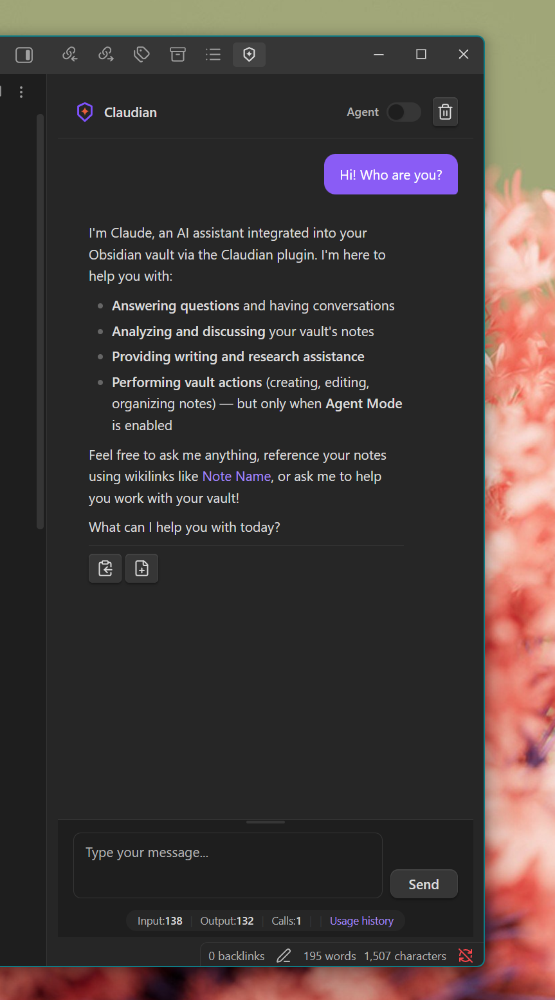
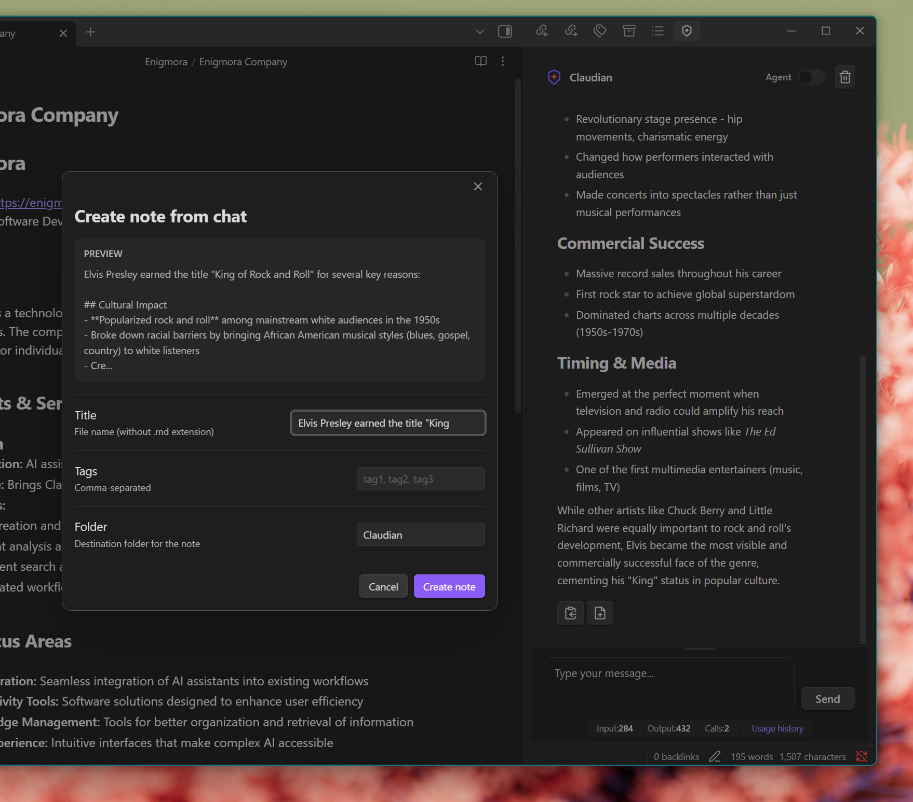

# Chat Interface

The chat interface is Claudian's primary feature, providing a dedicated panel for conversing with Claude directly within Obsidian.

---

## Opening the Chat

There are multiple ways to open the chat panel:

1. **Ribbon Icon**: Click the Claudian icon in the left ribbon
2. **Command Palette**: Press `Ctrl/Cmd + P` and search for "Open chat with Claude"
3. **Hotkey**: Assign a custom hotkey in Obsidian settings

---

## Interface Overview

The chat panel consists of:

| Element | Description |
|---------|-------------|
| **Header** | Title with Agent Mode toggle and clear button |
| **Message Area** | Scrollable conversation history |
| **Input Area** | Resizable text input for your messages |
| **Send/Stop Button** | Sends messages or stops ongoing requests |

---

## Sending Messages

### Basic Usage

1. Type your message in the input area
2. Press `Enter` or click **Send**
3. Claude's response will appear with real-time streaming

### Keyboard Shortcuts

| Shortcut | Action |
|----------|--------|
| `Enter` | Send message |
| `Shift + Enter` | New line (without sending) |

### Resizable Input

The input area can be resized by dragging its top edge. This is useful for longer messages or code blocks.

---

## Real-time Streaming

Responses appear character by character as Claude generates them. This provides:

- Immediate feedback that your message was received
- Ability to read responses as they're being written
- Visual indication of ongoing processing

---

## Stopping Requests

While Claude is generating a response, the Send button transforms into a **Stop** button. Click it to:

- Cancel the current request immediately
- Stop waiting for long responses
- Free up to send a new message

The Stop button appears with a distinctive red color to indicate it will cancel the operation. After stopping, you can send a new message right away.

---

## Message Actions

Each Claude response includes action buttons:

### Copy Response

Click the **Copy** button to copy the response text to your clipboard.

### Create Note

Click **Create note** to save the response as a new note:

1. A modal appears with suggested title and tags
2. Edit the title if needed
3. Add or remove suggested tags
4. Click **Create** to save

The note will be created with:
- YAML frontmatter (created date, tags, source)
- Formatted content from the response
- Related wikilinks (if detected)

---

## Chat History

The conversation history persists during your session. Messages are displayed with:

- Your messages aligned right with a distinct background
- Claude's messages aligned left with markdown formatting
- Timestamps for reference

### Clearing History

Click the trash icon in the header or use the command "Clear chat history" to start fresh.

**Note:** Chat history is not persisted between Obsidian sessions. Closing Obsidian will clear the conversation.

---

## Markdown Rendering

Claude's responses support full markdown:

- **Headers** and text formatting
- **Code blocks** with syntax highlighting
- **Lists** and tables
- **Links** and images
- **LaTeX** math expressions (if enabled in Obsidian)

---

## Agent Mode Toggle

The chat header includes an Agent Mode toggle. When enabled:

- Claude can execute actions on your vault
- An indicator shows agent mode is active
- Destructive actions require confirmation

See [Agent Mode](Agent-Mode) for complete documentation.

---

## Context and Memory

### Current Behavior

- Chat maintains context within the current session
- Claude remembers previous messages in the conversation
- Context is cleared when you clear chat or restart Obsidian

### Vault Context

For note processing commands, Claude receives:
- Note titles from your vault (configurable limit)
- Existing tags (configurable limit)
- This helps with wikilink and tag suggestions

---

## Tips for Effective Conversations

1. **Be specific**: Clear questions get better answers
2. **Provide context**: Reference notes or topics you're discussing
3. **Use follow-ups**: Build on previous responses
4. **Try different prompts**: If a response isn't helpful, rephrase your question

---

## Related Features

- [Agent Mode](Agent-Mode) - Vault management through chat
- [Configuration](../Configuration) - Customize chat behavior
