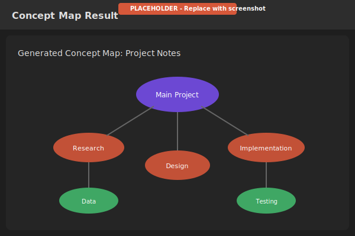
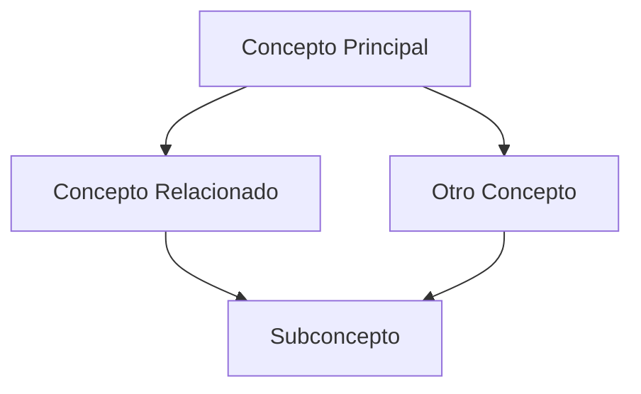
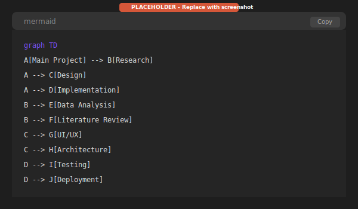
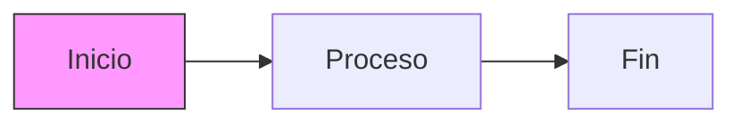

# Mapas Conceptuales

Los mapas conceptuales analizan tus notas y generan diagramas visuales que muestran relaciones entre conceptos, ayudándote a entender la estructura de tu conocimiento.

---

## Descripción General

El generador de mapas conceptuales:

- Analiza notas seleccionadas buscando conceptos clave
- Identifica relaciones entre conceptos
- Genera un diagrama visual en formato Mermaid
- Crea una nota con el análisis completo

---

## Generar un Mapa Conceptual

1. Abre la paleta de comandos con `Ctrl/Cmd + P`
2. Busca **"Generar mapa conceptual"**
3. Selecciona las notas a analizar
4. Ingresa un título para tu mapa conceptual
5. Haz clic en **Generar**

---

## Seleccionar Notas

Elige notas que estén relacionadas con un tema:

- Selecciona de una carpeta específica
- Elige notas individuales
- Mezcla de diferentes carpetas

**Consejo:** Los mejores resultados vienen de 3-10 notas relacionadas.

---

## Salida

El generador crea una nueva nota que contiene:

### 1. Conceptos Principales

Ideas clave extraídas de tus notas, organizadas por importancia.

### 2. Conceptos Secundarios

Ideas de apoyo y detalles relacionados con los conceptos principales.

### 3. Relaciones

Conexiones entre conceptos, incluyendo:
- Relaciones padre-hijo
- Asociaciones
- Dependencias
- Contrastes

### 4. Temas Transversales

Temas que aparecen en múltiples notas.

### 5. Diagrama Mermaid

Un grafo visual renderizado en Obsidian:



---

## Diagrama Mermaid

El diagrama usa sintaxis Mermaid, que Obsidian renderiza automáticamente:



### Elementos del Diagrama

| Elemento | Significado |
|----------|-------------|
| Rectángulos | Conceptos principales |
| Cajas redondeadas | Conceptos secundarios |
| Flechas | Relaciones |
| Etiquetas en flechas | Tipo de relación |



---

## Ejemplo de Salida

```markdown
---
created: 2024-01-21
source: claudian-conceptmap
notes_analyzed: 5
---

# Mapa Conceptual: Fundamentos de Machine Learning

## Conceptos Principales

1. **Aprendizaje Supervisado**
   - Requiere datos etiquetados
   - Clasificación y regresión

2. **Redes Neuronales**
   - Capas de nodos interconectados
   - Base del deep learning

## Conceptos Secundarios

- Datos de entrenamiento
- Conjuntos de validación
- Hiperparámetros
- Funciones de activación

## Relaciones

- Aprendizaje Supervisado → requiere → Datos de Entrenamiento
- Redes Neuronales → usa → Funciones de Activación
- Deep Learning → es tipo de → Redes Neuronales

## Temas Transversales

- Optimización
- Calidad de datos
- Evaluación de modelos

## Mapa Visual

​```mermaid
graph TD
    ML[Machine Learning]
    SL[Aprendizaje Supervisado]
    UL[Aprendizaje No Supervisado]
    NN[Redes Neuronales]
    DL[Deep Learning]

    ML --> SL
    ML --> UL
    SL --> NN
    NN --> DL
​```

## Notas Fuente

- [[Intro a ML]]
- [[Básicos de Redes Neuronales]]
- [[Notas del Curso de Deep Learning]]
```

---

## Casos de Uso

### Revisión de Estudio

Crea mapas conceptuales de notas de curso para:
- Visualizar relaciones entre temas
- Identificar vacíos de conocimiento
- Prepararte para exámenes

### Organización de Investigación

Mapea notas de investigación para:
- Ver conexiones entre papers
- Encontrar oportunidades de síntesis
- Identificar direcciones de investigación

### Planificación de Proyectos

Mapea documentación de proyecto para:
- Entender arquitectura del sistema
- Identificar dependencias
- Encontrar puntos de integración

### Navegación de Base de Conocimiento

Mapea un área temática para:
- Crear páginas de vista general
- Guiar lectores a través del contenido
- Identificar conceptos huérfanos

---

## Consejos para Mejores Mapas

### Selección de Notas

- Elige notas relacionadas sobre un solo tema
- Incluye tanto notas de vista general como detalladas
- 5-10 notas funciona mejor

### Calidad de Notas

- Una estructura clara ayuda a la extracción
- Los encabezados mejoran la identificación de conceptos
- Términos bien definidos producen mejores mapas

### Títulos de Mapas

- Usa títulos descriptivos
- Incluye el alcance del tema
- Ejemplo: "Vista General de Frameworks Web Python"

---

## Mermaid en Obsidian

Obsidian renderiza diagramas Mermaid nativamente:

1. Ve la nota generada en modo Vista Previa
2. El diagrama se renderiza automáticamente
3. Los diagramas complejos pueden necesitar scroll horizontal

### Consejos de Mermaid

- Edita el código generado para refinar el diagrama
- Agrega color con declaraciones `style`
- Cambia el diseño con `direction` (TD, LR, etc.)

### Ejemplo de Personalización



---

## Limitaciones

- Conjuntos de notas muy grandes pueden producir mapas desordenados
- Las relaciones complejas pueden simplificarse
- Mermaid tiene restricciones de diseño
- Algunos matices pueden perderse en la visualización

---

## Características Relacionadas

- [Procesamiento por Lotes](Batch-Processing.es) - Extraer información específica
- [Interfaz de Chat](Chat-Interface.es) - Discutir conceptos con Claude
- [Configuración](../Configuration.es) - Ajustar configuración de procesamiento
