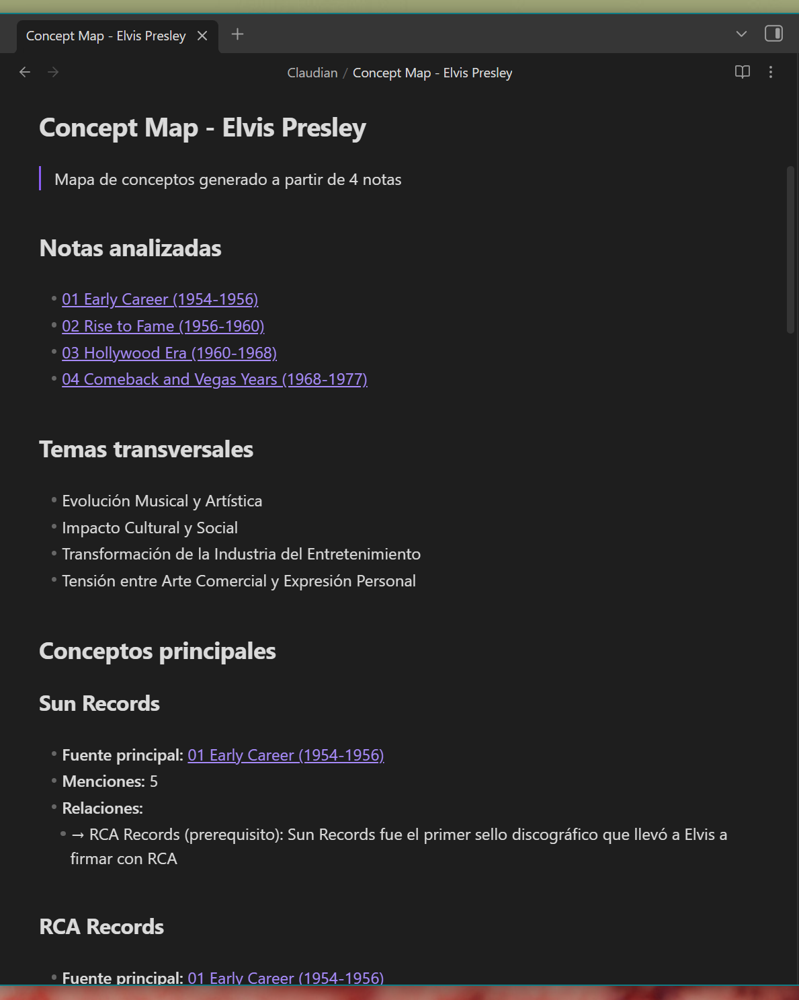
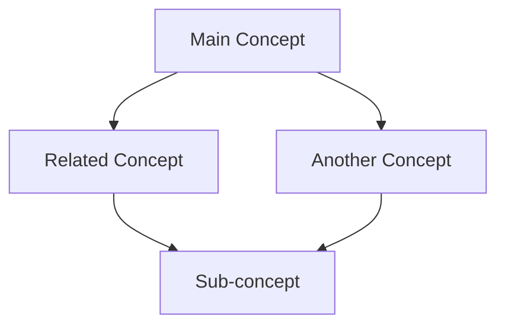
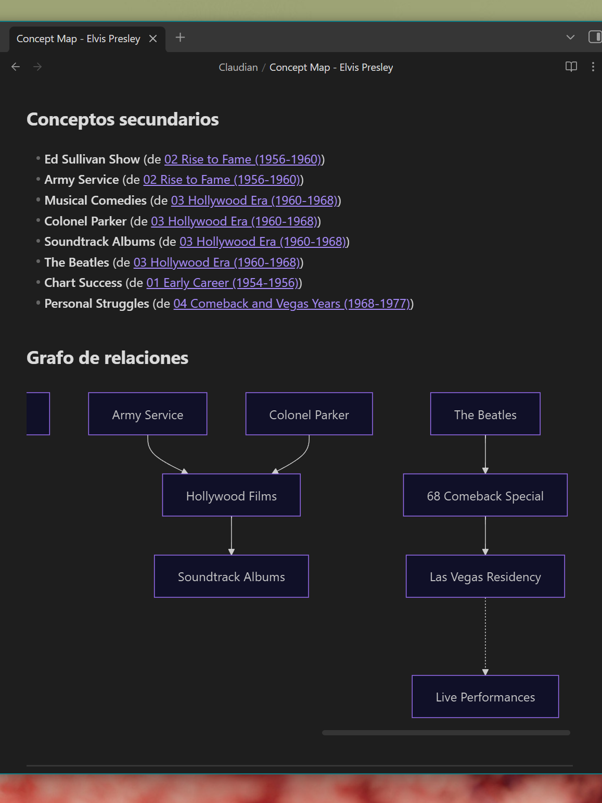
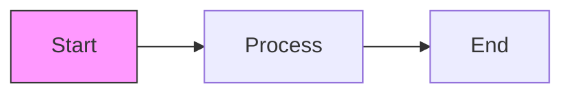

# Concept Maps

Concept maps analyze your notes and generate visual diagrams showing relationships between concepts, helping you understand the structure of your knowledge.

---

## Overview

The concept map generator:

- Analyzes selected notes for key concepts
- Identifies relationships between concepts
- Generates a visual diagram in Mermaid format
- Creates a note with the complete analysis

---

## Generating a Concept Map

1. Open the command palette with `Ctrl/Cmd + P`
2. Search for **"Generate concept map"**
3. Select the notes to analyze
4. Enter a title for your concept map
5. Click **Generate**

---

## Selecting Notes

Choose notes that are related to a topic:

- Select from a specific folder
- Choose individual notes
- Mix from different folders

**Tip:** Best results come from 3-10 related notes.

---

## Output

The generator creates a new note containing:

### 1. Main Concepts

Key ideas extracted from your notes, organized by importance.

### 2. Secondary Concepts

Supporting ideas and details related to main concepts.

### 3. Relationships

Connections between concepts, including:
- Parent-child relationships
- Associations
- Dependencies
- Contrasts

### 4. Cross-cutting Themes

Topics that appear across multiple notes.

### 5. Mermaid Diagram

A visual graph rendered in Obsidian:



---

## Mermaid Diagram

The diagram uses Mermaid syntax, which Obsidian renders automatically:



### Diagram Elements

| Element | Meaning |
|---------|---------|
| Rectangles | Main concepts |
| Rounded boxes | Secondary concepts |
| Arrows | Relationships |
| Labels on arrows | Relationship type |



---

## Example Output

```markdown
---
created: 2024-01-21
source: claudian-conceptmap
notes_analyzed: 5
---

# Concept Map: Machine Learning Fundamentals

## Main Concepts

1. **Supervised Learning**
   - Requires labeled data
   - Classification and regression

2. **Neural Networks**
   - Layers of interconnected nodes
   - Deep learning foundation

## Secondary Concepts

- Training data
- Validation sets
- Hyperparameters
- Activation functions

## Relationships

- Supervised Learning → requires → Training Data
- Neural Networks → uses → Activation Functions
- Deep Learning → is type of → Neural Networks

## Cross-cutting Themes

- Optimization
- Data quality
- Model evaluation

## Visual Map

​```mermaid
graph TD
    ML[Machine Learning]
    SL[Supervised Learning]
    UL[Unsupervised Learning]
    NN[Neural Networks]
    DL[Deep Learning]

    ML --> SL
    ML --> UL
    SL --> NN
    NN --> DL
​```

## Source Notes

- [[Intro to ML]]
- [[Neural Network Basics]]
- [[Deep Learning Course Notes]]
```

---

## Use Cases

### Study Review

Create concept maps from course notes to:
- Visualize topic relationships
- Identify knowledge gaps
- Prepare for exams

### Research Organization

Map research notes to:
- See connections between papers
- Find synthesis opportunities
- Identify research directions

### Project Planning

Map project documentation to:
- Understand system architecture
- Identify dependencies
- Find integration points

### Knowledge Base Navigation

Map a topic area to:
- Create overview pages
- Guide readers through content
- Identify orphan concepts

---

## Tips for Better Maps

### Note Selection

- Choose related notes on a single topic
- Include both overview and detailed notes
- 5-10 notes works best

### Note Quality

- Clear structure helps extraction
- Headers improve concept identification
- Well-defined terms produce better maps

### Map Titles

- Use descriptive titles
- Include the topic scope
- Example: "Python Web Frameworks Overview"

---

## Mermaid in Obsidian

Obsidian renders Mermaid diagrams natively:

1. View the generated note in Preview mode
2. The diagram renders automatically
3. Complex diagrams may need horizontal scrolling

### Mermaid Tips

- Edit the generated code to refine the diagram
- Add color with `style` declarations
- Change layout with `direction` (TD, LR, etc.)

### Example Customization



---

## Limitations

- Very large note sets may produce cluttered maps
- Complex relationships may be simplified
- Mermaid has layout constraints
- Some nuances may be lost in visualization

---

## Related Features

- [Batch Processing](Features-Batch-Processing) - Extract specific information
- [Chat Interface](Features-Chat-Interface) - Discuss concepts with Claude
- [Configuration](Configuration) - Adjust processing settings
