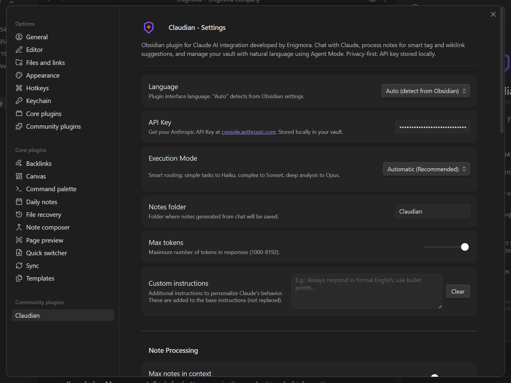

# Primeros Pasos

¡Bienvenido a Claudian! Esta guía te ayudará a instalar y configurar el plugin para empezar a chatear con Claude en Obsidian.

---

## Requisitos Previos

Antes de instalar Claudian, asegúrate de tener:

1. **Obsidian** v1.0.0 o superior instalado
2. Una **clave API de Anthropic** de [console.anthropic.com](https://console.anthropic.com)

---

## Instalación

### Instalación Manual

1. Descarga los archivos de la última versión desde [GitHub Releases](https://github.com/Enigmora/claudian/releases):
   - `main.js`
   - `manifest.json`
   - `styles.css`

2. Crea la carpeta del plugin en tu bóveda:
   ```
   .obsidian/plugins/claudian/
   ```

3. Copia los archivos descargados a la carpeta `claudian`

4. Reinicia Obsidian o recarga con `Ctrl/Cmd + R`

5. Ve a **Ajustes > Plugins de la comunidad** y activa **Claudian**

### Desde Plugins de la Comunidad (Próximamente)

Una vez publicado en los plugins de la comunidad de Obsidian:

1. Abre **Ajustes > Plugins de la comunidad**
2. Haz clic en **Explorar** y busca "Claudian"
3. Haz clic en **Instalar**, luego **Activar**

---

## Configuración Inicial

### 1. Obtén tu Clave API

1. Visita [console.anthropic.com](https://console.anthropic.com)
2. Regístrate o inicia sesión en tu cuenta de Anthropic
3. Navega a **API Keys**
4. Crea una nueva clave y cópiala

### 2. Configura Claudian

1. Abre los **Ajustes** de Obsidian
2. Navega a **Claudian** en la barra lateral izquierda
3. Pega tu clave API en el campo **Clave API**
4. Selecciona tu **Modelo** preferido (Claude Sonnet 4 recomendado para uso general)



### 3. Abre el Chat

1. Haz clic en el ícono de Claudian en la cinta izquierda, o
2. Usa la paleta de comandos (`Ctrl/Cmd + P`) y busca **"Abrir chat con Claude"**

---

## Primera Conversación

1. Escribe un mensaje en el área de entrada en la parte inferior del panel de chat
2. Presiona `Enter` o haz clic en **Enviar**
3. Observa la respuesta de Claude aparecer en tiempo real con streaming


### Crear una Nota desde una Respuesta

1. Después de recibir una respuesta, haz clic en el botón **Crear nota**
2. Edita el título y los tags sugeridos
3. La nota se guardará con el formato adecuado (frontmatter YAML, wikilinks)

---

## Siguientes Pasos

Ahora que estás listo:

- [Configura](Configuration.es) ajustes adicionales como la carpeta de notas y límites de contexto
- Explora las funciones de la [Interfaz de Chat](Features/Chat-Interface.es) en detalle
- Prueba el [Modo Agente](Features/Agent-Mode.es) para gestionar tu bóveda con lenguaje natural
- Procesa múltiples notas con [Procesamiento por Lotes](Features/Batch-Processing.es)

---

## Desinstalación

Para eliminar Claudian:

1. Ve a **Ajustes > Plugins de la comunidad**
2. Encuentra **Claudian** y haz clic en **Desinstalar**
3. Opcionalmente, elimina la carpeta del plugin:
   ```
   .obsidian/plugins/claudian/
   ```

Tus notas y el contenido de tu bóveda no se verán afectados.
